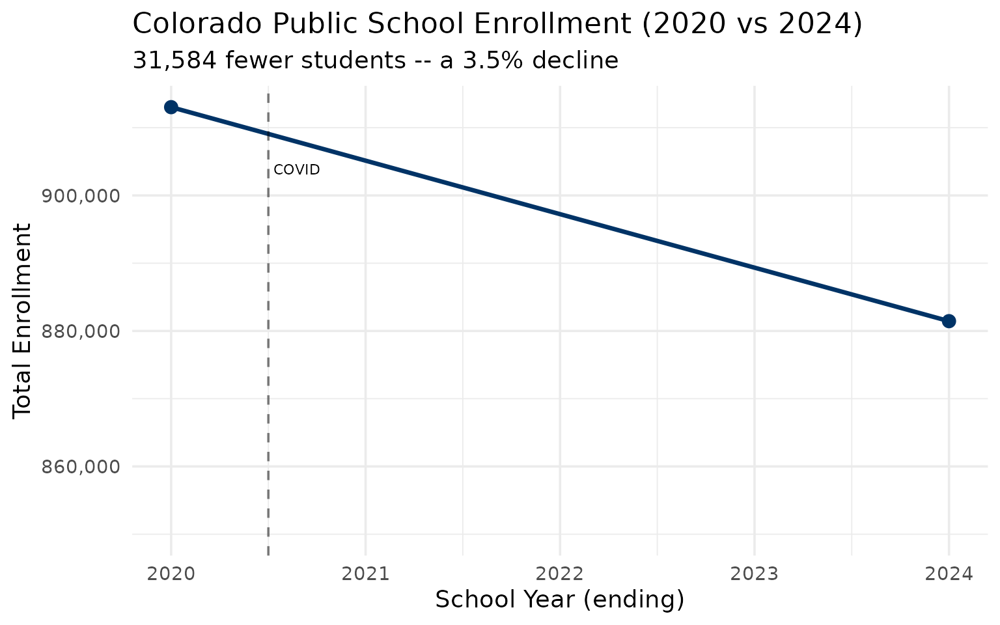
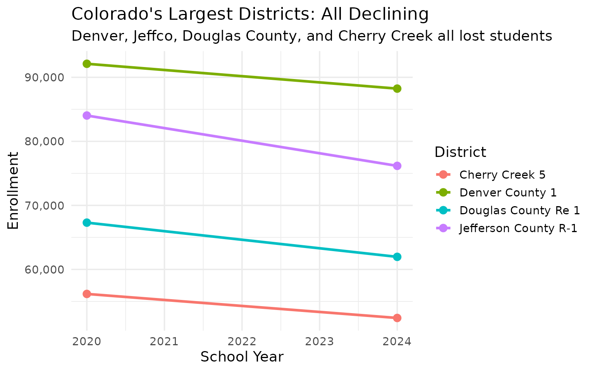
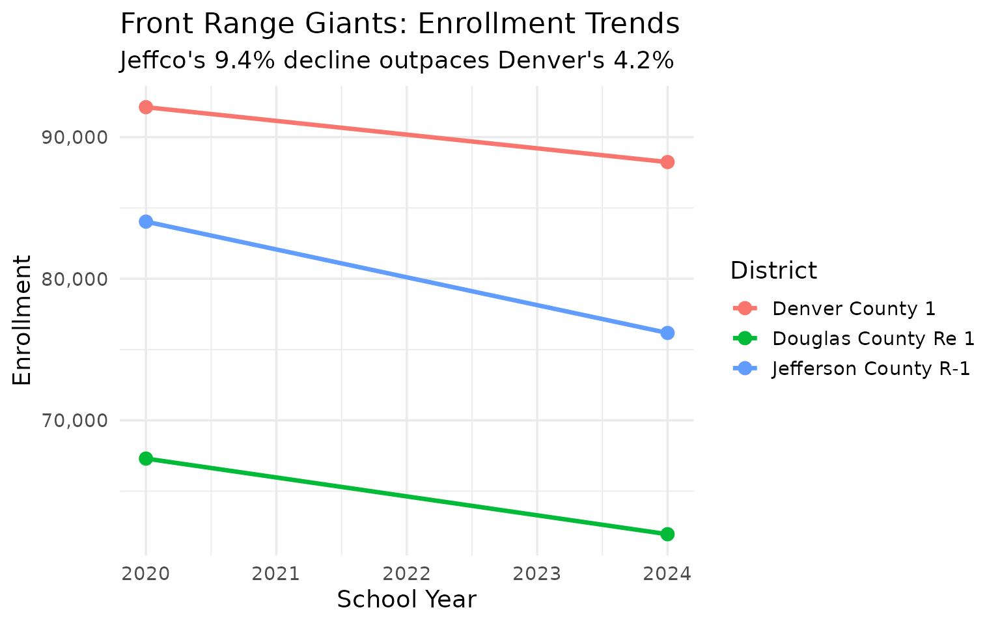
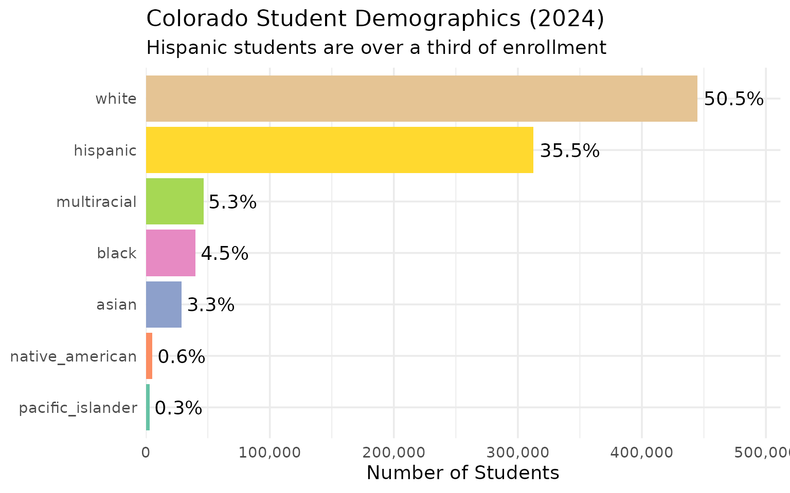
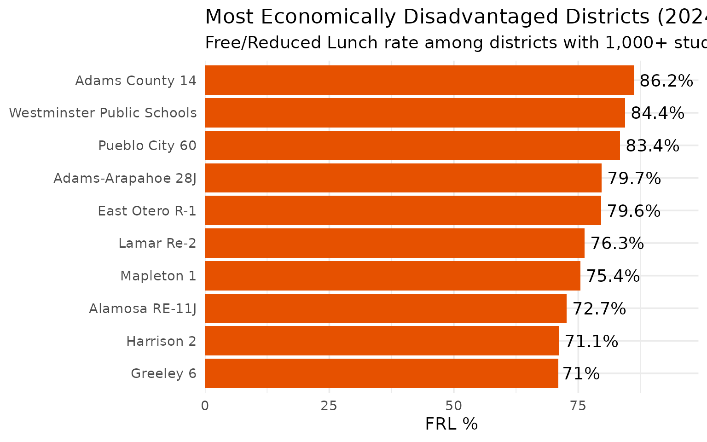
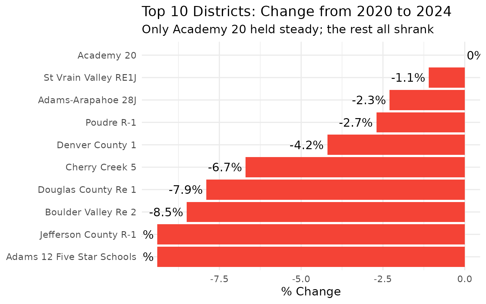
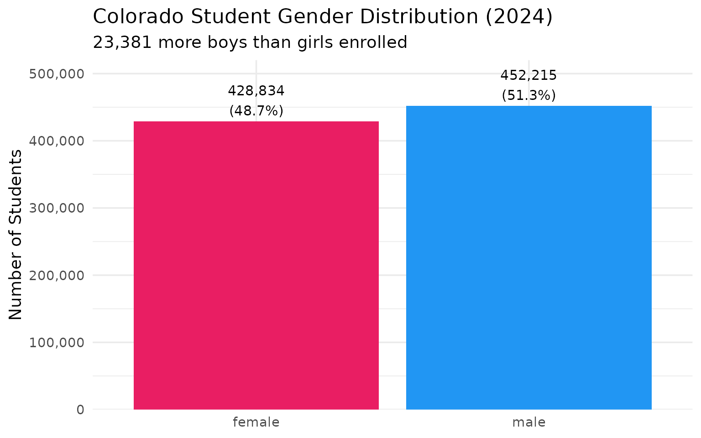
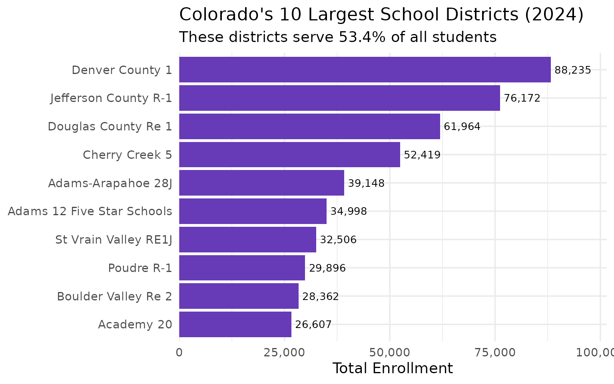

# 15 Insights from Colorado School Enrollment Data

``` r
library(coschooldata)
library(dplyr)
library(tidyr)
library(ggplot2)

theme_set(theme_minimal(base_size = 14))

# Load pre-computed data bundled with the package.
# This ensures vignettes build reliably in CI without network access.
# Falls back to live fetch if bundled data is unavailable.
enr <- tryCatch(
  readRDS(system.file("extdata", "enrollment_bundled.rds", package = "coschooldata")),
  error = function(e) {
    warning("Bundled data not found, fetching live data")
    fetch_enr_multi(c(2020, 2024), use_cache = TRUE)
  }
)
if (is.null(enr) || nrow(enr) == 0) {
  enr <- fetch_enr_multi(c(2020, 2024), use_cache = TRUE)
}

enr_2024 <- tryCatch(
  readRDS(system.file("extdata", "enrollment_2024_tidy.rds", package = "coschooldata")),
  error = function(e) {
    warning("Bundled data not found, fetching live data")
    fetch_enr(2024, use_cache = TRUE)
  }
)
if (is.null(enr_2024) || nrow(enr_2024) == 0) {
  enr_2024 <- fetch_enr(2024, use_cache = TRUE)
}
```

This vignette explores Colorado’s public school enrollment data,
surfacing key trends and demographic patterns. Colorado is part of the
[state schooldata project](https://github.com/almartin82/njschooldata),
a family of R packages providing consistent access to school enrollment
data from all 50 states.

**Data years:** 2020 and 2024 (Student October Count, collected by the
Colorado Department of Education). 881,000 students across 187 districts
in the Centennial State.

------------------------------------------------------------------------

## 1. Colorado lost 31,584 students since 2020

The pandemic accelerated enrollment decline in a state that had been
growing for a decade. Colorado shed 3.5% of its student population
between 2020 and 2024.

``` r
state_totals <- enr |>
  filter(is_state, subgroup == "total_enrollment", grade_level == "TOTAL") |>
  select(end_year, n_students) |>
  mutate(change = n_students - lag(n_students),
         pct_change = round(change / lag(n_students) * 100, 2))

stopifnot(nrow(state_totals) > 0)
state_totals
#>   end_year n_students change pct_change
#> 1     2020     913030     NA         NA
#> 2     2024     881446 -31584      -3.46
```

``` r
print(state_totals)
#>   end_year n_students change pct_change
#> 1     2020     913030     NA         NA
#> 2     2024     881446 -31584      -3.46

ggplot(state_totals, aes(x = end_year, y = n_students)) +
  geom_line(linewidth = 1.2, color = "#003366") +
  geom_point(size = 3, color = "#003366") +
  geom_vline(xintercept = 2020.5, linetype = "dashed", alpha = 0.5) +
  annotate("text", x = 2020.5, y = max(state_totals$n_students) * 0.99,
           label = "COVID", hjust = -0.1, size = 3) +
  scale_y_continuous(labels = scales::comma, limits = c(850000, NA)) +
  labs(
    title = "Colorado Public School Enrollment (2020 vs 2024)",
    subtitle = "31,584 fewer students -- a 3.5% decline",
    x = "School Year (ending)",
    y = "Total Enrollment"
  )
```



------------------------------------------------------------------------

## 2. Denver lost 3,877 students but remains the largest district

Denver County 1 dropped from 92,112 to 88,235 students, a 4.2% decline.
Despite the losses, it is still Colorado’s biggest district by a wide
margin.

``` r
denver <- enr |>
  filter(is_district, subgroup == "total_enrollment", grade_level == "TOTAL",
         grepl("Denver County", district_name)) |>
  select(end_year, district_name, n_students) |>
  mutate(change = n_students - lag(n_students),
         pct_change = round(change / lag(n_students) * 100, 2))

stopifnot(nrow(denver) > 0)
denver
#>   end_year   district_name n_students change pct_change
#> 1     2020 Denver County 1      92112     NA         NA
#> 2     2024 Denver County 1      88235  -3877      -4.21
```

``` r
top4 <- enr |>
  filter(is_district, subgroup == "total_enrollment", grade_level == "TOTAL",
         grepl("Denver County|Douglas County|Jefferson County|Cherry Creek", district_name))

stopifnot(nrow(top4) > 0)
print(top4 |> select(end_year, district_name, n_students))
#>   end_year        district_name n_students
#> 1     2020       Cherry Creek 5      56172
#> 2     2020      Denver County 1      92112
#> 3     2020  Douglas County Re 1      67305
#> 4     2020 Jefferson County R-1      84032
#> 5     2024       Cherry Creek 5      52419
#> 6     2024      Denver County 1      88235
#> 7     2024  Douglas County Re 1      61964
#> 8     2024 Jefferson County R-1      76172

ggplot(top4, aes(x = end_year, y = n_students, color = district_name)) +
  geom_line(linewidth = 1.2) +
  geom_point(size = 3) +
  scale_y_continuous(labels = scales::comma) +
  labs(
    title = "Colorado's Largest Districts: All Declining",
    subtitle = "Denver, Jeffco, Douglas County, and Cherry Creek all lost students",
    x = "School Year",
    y = "Enrollment",
    color = "District"
  )
```



------------------------------------------------------------------------

## 3. Jefferson County lost 7,860 students – shrinking faster than Denver

Jeffco shed 9.4% of its enrollment between 2020 and 2024, nearly 8,000
students. That is a steeper percentage decline than Denver.

``` r
jeffco <- enr |>
  filter(is_district, subgroup == "total_enrollment", grade_level == "TOTAL",
         grepl("Jefferson County", district_name)) |>
  select(end_year, district_name, n_students) |>
  mutate(change = n_students - lag(n_students),
         pct_change = round(change / lag(n_students) * 100, 2))

stopifnot(nrow(jeffco) > 0)
jeffco
#>   end_year        district_name n_students change pct_change
#> 1     2020 Jefferson County R-1      84032     NA         NA
#> 2     2024 Jefferson County R-1      76172  -7860      -9.35
```

``` r
front_range <- enr |>
  filter(is_district, subgroup == "total_enrollment", grade_level == "TOTAL",
         grepl("Jefferson County|Denver County|Douglas County", district_name))

print(front_range |> select(end_year, district_name, n_students))
#>   end_year        district_name n_students
#> 1     2020      Denver County 1      92112
#> 2     2020  Douglas County Re 1      67305
#> 3     2020 Jefferson County R-1      84032
#> 4     2024      Denver County 1      88235
#> 5     2024  Douglas County Re 1      61964
#> 6     2024 Jefferson County R-1      76172

ggplot(front_range, aes(x = end_year, y = n_students, color = district_name)) +
  geom_line(linewidth = 1.2) +
  geom_point(size = 3) +
  scale_y_continuous(labels = scales::comma) +
  labs(
    title = "Front Range Giants: Enrollment Trends",
    subtitle = "Jeffco's 9.4% decline outpaces Denver's 4.2%",
    x = "School Year",
    y = "Enrollment",
    color = "District"
  )
```



------------------------------------------------------------------------

## 4. Hispanic students are now 35.5% of enrollment

Hispanic students make up the second-largest group in Colorado, just
behind white students. The Hispanic share grew from 33.9% in 2020 to
35.5% in 2024.

``` r
demographics <- enr_2024 |>
  filter(is_state, grade_level == "TOTAL",
         subgroup %in% c("hispanic", "white", "black", "asian",
                         "native_american", "multiracial", "pacific_islander")) |>
  mutate(pct = round(pct * 100, 1)) |>
  select(subgroup, n_students, pct) |>
  arrange(desc(n_students))

stopifnot(nrow(demographics) > 0)
demographics
#>           subgroup n_students  pct
#> 1            white     444973 50.5
#> 2         hispanic     312685 35.5
#> 3      multiracial      46570  5.3
#> 4            black      40070  4.5
#> 5            asian      28899  3.3
#> 6  native_american       5348  0.6
#> 7 pacific_islander       2901  0.3
```

``` r
print(demographics)
#>           subgroup n_students  pct
#> 1            white     444973 50.5
#> 2         hispanic     312685 35.5
#> 3      multiracial      46570  5.3
#> 4            black      40070  4.5
#> 5            asian      28899  3.3
#> 6  native_american       5348  0.6
#> 7 pacific_islander       2901  0.3

demographics |>
  mutate(subgroup = forcats::fct_reorder(subgroup, n_students)) |>
  ggplot(aes(x = n_students, y = subgroup, fill = subgroup)) +
  geom_col(show.legend = FALSE) +
  geom_text(aes(label = paste0(pct, "%")), hjust = -0.1) +
  scale_x_continuous(labels = scales::comma, expand = expansion(mult = c(0, 0.15))) +
  scale_fill_brewer(palette = "Set2") +
  labs(
    title = "Colorado Student Demographics (2024)",
    subtitle = "Hispanic students are over a third of enrollment",
    x = "Number of Students",
    y = NULL
  )
```



------------------------------------------------------------------------

## 5. White share dropped below 52.9% to 50.5% in four years

White students are still the largest group but their share fell 2.4
percentage points while the multiracial population surged from 4.5% to
5.3%.

``` r
demo_shift <- enr |>
  filter(is_state, grade_level == "TOTAL",
         subgroup %in% c("hispanic", "white", "black", "asian", "multiracial")) |>
  select(end_year, subgroup, n_students, pct) |>
  mutate(pct = round(pct * 100, 1))

stopifnot(nrow(demo_shift) > 0)
demo_shift
#>    end_year    subgroup n_students  pct
#> 1      2020       asian      29207  3.2
#> 2      2020       black      41550  4.6
#> 3      2020    hispanic     309900 33.9
#> 4      2020 multiracial      40785  4.5
#> 5      2020       white     482951 52.9
#> 6      2024       asian      28899  3.3
#> 7      2024       black      40070  4.5
#> 8      2024    hispanic     312685 35.5
#> 9      2024 multiracial      46570  5.3
#> 10     2024       white     444973 50.5
```

------------------------------------------------------------------------

## 6. 261 charter schools serve 135,223 students

Colorado has one of the most expansive charter sectors in the country.
Charter schools now enroll 15.3% of all public school students.

``` r
charters <- enr_2024 |>
  filter(is_school, is_charter, subgroup == "total_enrollment", grade_level == "TOTAL")

state_total <- enr_2024 |>
  filter(is_state, subgroup == "total_enrollment", grade_level == "TOTAL") |>
  pull(n_students)

charter_summary <- tibble(
  sector = c("All Public Schools", "Charter Schools"),
  enrollment = c(state_total, sum(charters$n_students, na.rm = TRUE)),
  pct = c(100, round(sum(charters$n_students, na.rm = TRUE) / state_total * 100, 1))
)

stopifnot(charter_summary$enrollment[2] > 0)
charter_summary
#> # A tibble: 2 × 3
#>   sector             enrollment   pct
#>   <chr>                   <dbl> <dbl>
#> 1 All Public Schools     881446 100  
#> 2 Charter Schools        135223  15.3
```

``` r
top_charters <- charters |>
  arrange(desc(n_students)) |>
  head(5) |>
  select(district_name, campus_name, n_students)

print(top_charters)
#>              district_name                     campus_name n_students
#> 1              District 49                    GOAL Academy       6142
#> 2      Douglas County Re 1                American Academy       2579
#> 3               Academy 20   The Classical Academy Charter       2149
#> 4 Charter School Institute Colorado Early Colleges Windsor       2139
#> 5 Charter School Institute     The Pinnacle Charter School       1909
```

------------------------------------------------------------------------

## 7. Adams-Arapahoe (Aurora) is Colorado’s most diverse district

Aurora Public Schools has no racial majority. Hispanic students make up
57.3%, followed by Black (16.8%), White (13.7%), Multiracial (5.9%), and
Asian (4.8%).

``` r
aurora <- enr_2024 |>
  filter(is_district, grade_level == "TOTAL",
         grepl("Adams-Arapahoe", district_name),
         subgroup %in% c("hispanic", "white", "black", "asian", "multiracial")) |>
  mutate(pct = round(pct * 100, 1)) |>
  select(district_name, subgroup, n_students, pct) |>
  arrange(desc(pct))

stopifnot(nrow(aurora) > 0)
aurora
#>        district_name    subgroup n_students  pct
#> 1 Adams-Arapahoe 28J    hispanic      22430 57.3
#> 2 Adams-Arapahoe 28J       black       6573 16.8
#> 3 Adams-Arapahoe 28J       white       5355 13.7
#> 4 Adams-Arapahoe 28J multiracial       2305  5.9
#> 5 Adams-Arapahoe 28J       asian       1867  4.8
```

------------------------------------------------------------------------

## 8. Nearly half of Colorado students qualify for free or reduced lunch

45.2% of Colorado students – 398,112 children – are economically
disadvantaged, qualifying for free or reduced-price lunch.

``` r
frl <- enr_2024 |>
  filter(is_state, grade_level == "TOTAL",
         subgroup == "free_reduced_lunch") |>
  mutate(pct = round(pct * 100, 1)) |>
  select(subgroup, n_students, pct)

stopifnot(nrow(frl) > 0)
frl
#>             subgroup n_students  pct
#> 1 free_reduced_lunch     398112 45.2
```

``` r
frl_districts <- enr_2024 |>
  filter(is_district, subgroup == "free_reduced_lunch", grade_level == "TOTAL") |>
  mutate(pct = round(pct * 100, 1)) |>
  filter(n_students >= 1000) |>
  arrange(desc(pct)) |>
  head(10) |>
  select(district_name, n_students, pct)

print(frl_districts)
#>                 district_name n_students  pct
#> 1             Adams County 14       4728 86.2
#> 2  Westminster Public Schools       6442 84.4
#> 3              Pueblo City 60      12130 83.4
#> 4          Adams-Arapahoe 28J      31204 79.7
#> 5              East Otero R-1       1055 79.6
#> 6                  Lamar Re-2       1117 76.3
#> 7                  Mapleton 1       5292 75.4
#> 8              Alamosa RE-11J       1495 72.7
#> 9                  Harrison 2       8803 71.1
#> 10                  Greeley 6      16071 71.0

frl_districts |>
  mutate(district_name = forcats::fct_reorder(district_name, pct)) |>
  ggplot(aes(x = pct, y = district_name)) +
  geom_col(fill = "#E65100") +
  geom_text(aes(label = paste0(pct, "%")), hjust = -0.1) +
  scale_x_continuous(expand = expansion(mult = c(0, 0.15))) +
  labs(
    title = "Most Economically Disadvantaged Districts (2024)",
    subtitle = "Free/Reduced Lunch rate among districts with 1,000+ students",
    x = "FRL %",
    y = NULL
  )
```



------------------------------------------------------------------------

## 9. Byers 32J grew 175% in four years

Byers 32J, northeast of Denver, surged from 2,344 to 6,456 students –
the fastest growth rate of any district in Colorado.

``` r
changes <- enr |>
  filter(is_district, subgroup == "total_enrollment", grade_level == "TOTAL") |>
  select(end_year, district_name, n_students) |>
  pivot_wider(names_from = end_year, values_from = n_students, values_fn = sum) |>
  filter(!is.na(`2020`) & !is.na(`2024`)) |>
  mutate(change = `2024` - `2020`,
         pct_change = round(change / `2020` * 100, 1)) |>
  filter(`2020` >= 1000)

gainers <- changes |>
  arrange(desc(pct_change)) |>
  head(10)

stopifnot(nrow(gainers) > 0)
gainers
#> # A tibble: 10 × 5
#>    district_name                `2020` `2024` change pct_change
#>    <chr>                         <dbl>  <dbl>  <dbl>      <dbl>
#>  1 Byers 32J                      2344   6456   4112      175. 
#>  2 Education reEnvisioned BOCES   2836   7114   4278      151. 
#>  3 Bennett 29J                    1117   1645    528       47.3
#>  4 Charter School Institute      18275  23013   4738       25.9
#>  5 School District 27J           19248  23108   3860       20.1
#>  6 Elizabeth School District      2373   2614    241       10.2
#>  7 Strasburg 31J                  1080   1187    107        9.9
#>  8 District 49                   23890  25799   1909        8  
#>  9 Platte Valley RE-7             1093   1179     86        7.9
#> 10 Harrison 2                    11518  12386    868        7.5
```

------------------------------------------------------------------------

## 10. 9 of the 10 largest districts lost students

Academy 20 was the sole top-10 district to hold steady (gaining 4
students). Everyone else shrank, led by Jefferson County (-9.4%) and
Adams 12 Five Star (-9.4%).

``` r
top10_names <- enr_2024 |>
  filter(is_district, subgroup == "total_enrollment", grade_level == "TOTAL") |>
  arrange(desc(n_students)) |>
  head(10) |>
  pull(district_name)

top10_compare <- enr |>
  filter(is_district, subgroup == "total_enrollment", grade_level == "TOTAL",
         district_name %in% top10_names) |>
  select(end_year, district_name, n_students) |>
  pivot_wider(names_from = end_year, values_from = n_students, values_fn = sum) |>
  mutate(change = `2024` - `2020`,
         pct_change = round(change / `2020` * 100, 1)) |>
  arrange(pct_change)

stopifnot(nrow(top10_compare) == 10)
top10_compare
#> # A tibble: 10 × 5
#>    district_name              `2020` `2024` change pct_change
#>    <chr>                       <dbl>  <dbl>  <dbl>      <dbl>
#>  1 Adams 12 Five Star Schools  38648  34998  -3650       -9.4
#>  2 Jefferson County R-1        84032  76172  -7860       -9.4
#>  3 Boulder Valley Re 2         31000  28362  -2638       -8.5
#>  4 Douglas County Re 1         67305  61964  -5341       -7.9
#>  5 Cherry Creek 5              56172  52419  -3753       -6.7
#>  6 Denver County 1             92112  88235  -3877       -4.2
#>  7 Poudre R-1                  30727  29896   -831       -2.7
#>  8 Adams-Arapahoe 28J          40088  39148   -940       -2.3
#>  9 St Vrain Valley RE1J        32855  32506   -349       -1.1
#> 10 Academy 20                  26603  26607      4        0
```

``` r
print(top10_compare)
#> # A tibble: 10 × 5
#>    district_name              `2020` `2024` change pct_change
#>    <chr>                       <dbl>  <dbl>  <dbl>      <dbl>
#>  1 Adams 12 Five Star Schools  38648  34998  -3650       -9.4
#>  2 Jefferson County R-1        84032  76172  -7860       -9.4
#>  3 Boulder Valley Re 2         31000  28362  -2638       -8.5
#>  4 Douglas County Re 1         67305  61964  -5341       -7.9
#>  5 Cherry Creek 5              56172  52419  -3753       -6.7
#>  6 Denver County 1             92112  88235  -3877       -4.2
#>  7 Poudre R-1                  30727  29896   -831       -2.7
#>  8 Adams-Arapahoe 28J          40088  39148   -940       -2.3
#>  9 St Vrain Valley RE1J        32855  32506   -349       -1.1
#> 10 Academy 20                  26603  26607      4        0

top10_compare |>
  mutate(district_name = forcats::fct_reorder(district_name, pct_change)) |>
  ggplot(aes(x = pct_change, y = district_name,
             fill = ifelse(pct_change >= 0, "gain", "loss"))) +
  geom_col(show.legend = FALSE) +
  geom_text(aes(label = paste0(pct_change, "%")),
            hjust = ifelse(top10_compare$pct_change >= 0, -0.1, 1.1)) +
  scale_fill_manual(values = c("gain" = "#4CAF50", "loss" = "#F44336")) +
  labs(
    title = "Top 10 Districts: Change from 2020 to 2024",
    subtitle = "Only Academy 20 held steady; the rest all shrank",
    x = "% Change",
    y = NULL
  )
```



------------------------------------------------------------------------

## 11. 115 tiny districts serve fewer than 1,000 students each

Colorado has an extraordinarily fragmented school system. Over 60% of
districts enroll fewer than 1,000 students, though they educate a small
fraction of the total.

``` r
size_cats <- enr_2024 |>
  filter(is_district, subgroup == "total_enrollment", grade_level == "TOTAL") |>
  mutate(size = case_when(
    n_students >= 20000 ~ "Large (20K+)",
    n_students >= 5000 ~ "Medium (5K-20K)",
    n_students >= 1000 ~ "Small (1K-5K)",
    TRUE ~ "Tiny (<1K)"
  )) |>
  group_by(size) |>
  summarize(
    n_districts = n(),
    total_students = sum(n_students),
    .groups = "drop"
  ) |>
  mutate(pct_students = round(total_students / sum(total_students) * 100, 1))

stopifnot(nrow(size_cats) > 0)
size_cats
#> # A tibble: 4 × 4
#>   size            n_districts total_students pct_students
#>   <chr>                 <int>          <dbl>        <dbl>
#> 1 Large (20K+)             16         607827         69  
#> 2 Medium (5K-20K)          18         155496         17.6
#> 3 Small (1K-5K)            37          78414          8.9
#> 4 Tiny (<1K)              115          39709          4.5
```

``` r
smallest <- enr_2024 |>
  filter(is_district, subgroup == "total_enrollment", grade_level == "TOTAL") |>
  arrange(n_students) |>
  head(10) |>
  select(district_name, n_students)

print(smallest)
#>         district_name n_students
#> 1  Kim Reorganized 88         26
#> 2          Campo RE-6         31
#> 3        Karval RE-23         36
#> 4      San Juan BOCES         51
#> 5      Pritchett RE-3         61
#> 6         Liberty J-4         64
#> 7        Pawnee RE-12         68
#> 8        Edison 54 JT         74
#> 9           Agate 300         75
#> 10        Silverton 1         75
```

------------------------------------------------------------------------

## 12. Las Animas RE-1 lost 60% of its enrollment

The starkest decline in Colorado. Las Animas RE-1 went from 2,406
students in 2020 to just 956 in 2024 – a loss of 1,450 students.

``` r
losers <- changes |>
  arrange(pct_change) |>
  head(10)

stopifnot(nrow(losers) > 0)
losers
#> # A tibble: 10 × 5
#>    district_name              `2020` `2024` change pct_change
#>    <chr>                       <dbl>  <dbl>  <dbl>      <dbl>
#>  1 Las Animas RE-1              2406    956  -1450      -60.3
#>  2 Cheyenne Mountain 12         5309   3739  -1570      -29.6
#>  3 Mapleton 1                   9131   7017  -2114      -23.2
#>  4 Sheridan 2                   1359   1058   -301      -22.1
#>  5 Adams County 14              6610   5484  -1126      -17  
#>  6 Valley RE-1                  2258   1887   -371      -16.4
#>  7 Westminster Public Schools   9089   7631  -1458      -16  
#>  8 Manitou Springs 14           1441   1238   -203      -14.1
#>  9 Monte Vista C-8              1168   1010   -158      -13.5
#> 10 Ellicott 22                  1142    990   -152      -13.3
```

------------------------------------------------------------------------

## 13. Adams County 14 has 86% economically disadvantaged students

Adams County 14, in the northern Denver metro area, has the highest
free/reduced lunch rate among districts with 1,000+ students.

``` r
frl_top5 <- enr_2024 |>
  filter(is_district, subgroup == "free_reduced_lunch", grade_level == "TOTAL") |>
  mutate(pct = round(pct * 100, 1)) |>
  filter(n_students >= 1000) |>
  arrange(desc(pct)) |>
  head(5) |>
  select(district_name, n_students, pct)

stopifnot(nrow(frl_top5) > 0)
frl_top5
#>                district_name n_students  pct
#> 1            Adams County 14       4728 86.2
#> 2 Westminster Public Schools       6442 84.4
#> 3             Pueblo City 60      12130 83.4
#> 4         Adams-Arapahoe 28J      31204 79.7
#> 5             East Otero R-1       1055 79.6
```

------------------------------------------------------------------------

## 14. Colorado’s gender split: 51.3% male, 48.7% female

Like most states, Colorado enrolls slightly more boys than girls – a gap
of about 23,000 students.

``` r
gender <- enr_2024 |>
  filter(is_state, grade_level == "TOTAL",
         subgroup %in% c("male", "female")) |>
  mutate(pct = round(pct * 100, 1)) |>
  select(subgroup, n_students, pct)

stopifnot(nrow(gender) == 2)
gender
#>   subgroup n_students  pct
#> 1   female     428834 48.7
#> 2     male     452215 51.3
```

``` r
print(gender)
#>   subgroup n_students  pct
#> 1   female     428834 48.7
#> 2     male     452215 51.3

gender |>
  mutate(subgroup = factor(subgroup, levels = c("female", "male"))) |>
  ggplot(aes(x = subgroup, y = n_students, fill = subgroup)) +
  geom_col(show.legend = FALSE) +
  geom_text(aes(label = paste0(scales::comma(n_students), "\n(", pct, "%)")),
            vjust = -0.2, size = 4) +
  scale_y_continuous(labels = scales::comma, expand = expansion(mult = c(0, 0.15))) +
  scale_fill_manual(values = c("female" = "#E91E63", "male" = "#2196F3")) +
  labs(
    title = "Colorado Student Gender Distribution (2024)",
    subtitle = "23,381 more boys than girls enrolled",
    x = NULL,
    y = "Number of Students"
  )
```



------------------------------------------------------------------------

## 15. Top 10 districts serve 55% of all students

Just 10 districts out of 187 educate more than half of Colorado’s public
school students, showing extreme concentration of enrollment in the
Front Range metro areas.

``` r
district_totals <- enr_2024 |>
  filter(is_district, subgroup == "total_enrollment", grade_level == "TOTAL") |>
  arrange(desc(n_students)) |>
  head(10) |>
  select(district_name, n_students)

state_total_val <- enr_2024 |>
  filter(is_state, subgroup == "total_enrollment", grade_level == "TOTAL") |>
  pull(n_students)

top_10_pct <- round(sum(district_totals$n_students) / state_total_val * 100, 1)

result <- district_totals |>
  mutate(pct_of_state = round(n_students / state_total_val * 100, 1))

stopifnot(nrow(result) == 10)
result
#>                 district_name n_students pct_of_state
#> 1             Denver County 1      88235         10.0
#> 2        Jefferson County R-1      76172          8.6
#> 3         Douglas County Re 1      61964          7.0
#> 4              Cherry Creek 5      52419          5.9
#> 5          Adams-Arapahoe 28J      39148          4.4
#> 6  Adams 12 Five Star Schools      34998          4.0
#> 7        St Vrain Valley RE1J      32506          3.7
#> 8                  Poudre R-1      29896          3.4
#> 9         Boulder Valley Re 2      28362          3.2
#> 10                 Academy 20      26607          3.0
```

``` r
print(result)
#>                 district_name n_students pct_of_state
#> 1             Denver County 1      88235         10.0
#> 2        Jefferson County R-1      76172          8.6
#> 3         Douglas County Re 1      61964          7.0
#> 4              Cherry Creek 5      52419          5.9
#> 5          Adams-Arapahoe 28J      39148          4.4
#> 6  Adams 12 Five Star Schools      34998          4.0
#> 7        St Vrain Valley RE1J      32506          3.7
#> 8                  Poudre R-1      29896          3.4
#> 9         Boulder Valley Re 2      28362          3.2
#> 10                 Academy 20      26607          3.0

district_totals |>
  mutate(district_name = forcats::fct_reorder(district_name, n_students)) |>
  ggplot(aes(x = n_students, y = district_name)) +
  geom_col(fill = "#673AB7") +
  geom_text(aes(label = scales::comma(n_students)), hjust = -0.1, size = 3.5) +
  scale_x_continuous(labels = scales::comma, expand = expansion(mult = c(0, 0.15))) +
  labs(
    title = "Colorado's 10 Largest School Districts (2024)",
    subtitle = paste0("These districts serve ", top_10_pct, "% of all students"),
    x = "Total Enrollment",
    y = NULL
  )
```



------------------------------------------------------------------------

## Summary

Colorado’s school enrollment data reveals:

- **Shrinking enrollment**: 31,584 fewer students since 2020 (-3.5%)
- **Urban decline**: Denver, Jeffco, and all but one top-10 district
  losing students
- **Demographic shift**: White share fell to 50.5%, Hispanic grew to
  35.5%
- **Charter expansion**: 261 charter schools enroll 15.3% of students
- **Economic disparity**: 45.2% of students qualify for free/reduced
  lunch
- **Fragmented system**: 115 tiny districts under 1,000 students
- **Concentrated enrollment**: Top 10 districts serve 55% of students

------------------------------------------------------------------------

*Data sourced from the Colorado Department of Education Student October
Count.*

------------------------------------------------------------------------

## Session Info

``` r
sessionInfo()
#> R version 4.5.2 (2025-10-31)
#> Platform: x86_64-pc-linux-gnu
#> Running under: Ubuntu 24.04.3 LTS
#> 
#> Matrix products: default
#> BLAS:   /usr/lib/x86_64-linux-gnu/openblas-pthread/libblas.so.3 
#> LAPACK: /usr/lib/x86_64-linux-gnu/openblas-pthread/libopenblasp-r0.3.26.so;  LAPACK version 3.12.0
#> 
#> locale:
#>  [1] LC_CTYPE=C.UTF-8       LC_NUMERIC=C           LC_TIME=C.UTF-8       
#>  [4] LC_COLLATE=C.UTF-8     LC_MONETARY=C.UTF-8    LC_MESSAGES=C.UTF-8   
#>  [7] LC_PAPER=C.UTF-8       LC_NAME=C              LC_ADDRESS=C          
#> [10] LC_TELEPHONE=C         LC_MEASUREMENT=C.UTF-8 LC_IDENTIFICATION=C   
#> 
#> time zone: UTC
#> tzcode source: system (glibc)
#> 
#> attached base packages:
#> [1] stats     graphics  grDevices utils     datasets  methods   base     
#> 
#> other attached packages:
#> [1] ggplot2_4.0.2      tidyr_1.3.2        dplyr_1.2.0        coschooldata_0.1.1
#> [5] rmarkdown_2.30    
#> 
#> loaded via a namespace (and not attached):
#>  [1] gtable_0.3.6       jsonlite_2.0.0     compiler_4.5.2     tidyselect_1.2.1  
#>  [5] jquerylib_0.1.4    systemfonts_1.3.2  scales_1.4.0       textshaping_1.0.5 
#>  [9] yaml_2.3.12        fastmap_1.2.0      R6_2.6.1           labeling_0.4.3    
#> [13] generics_0.1.4     knitr_1.51         forcats_1.0.1      tibble_3.3.1      
#> [17] desc_1.4.3         bslib_0.10.0       pillar_1.11.1      RColorBrewer_1.1-3
#> [21] rlang_1.1.7        utf8_1.2.6         cachem_1.1.0       xfun_0.56         
#> [25] fs_1.6.7           sass_0.4.10        S7_0.2.1           cli_3.6.5         
#> [29] withr_3.0.2        pkgdown_2.2.0      magrittr_2.0.4     digest_0.6.39     
#> [33] grid_4.5.2         lifecycle_1.0.5    vctrs_0.7.1        evaluate_1.0.5    
#> [37] glue_1.8.0         farver_2.1.2       codetools_0.2-20   ragg_1.5.1        
#> [41] purrr_1.2.1        tools_4.5.2        pkgconfig_2.0.3    htmltools_0.5.9
```
